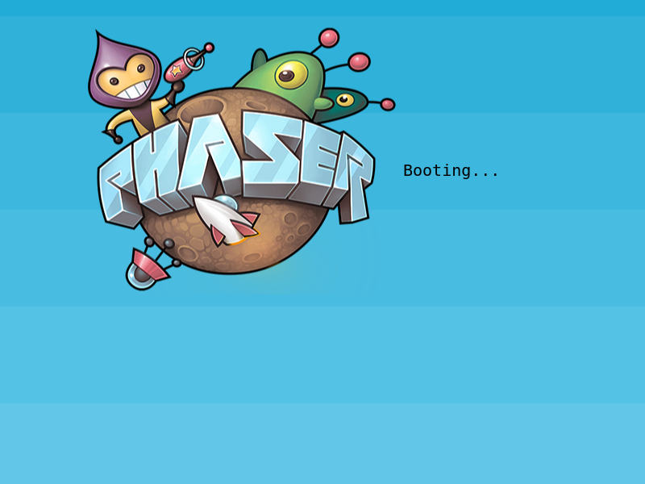
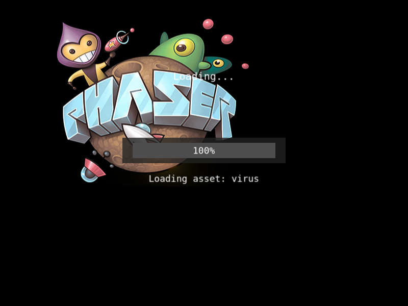
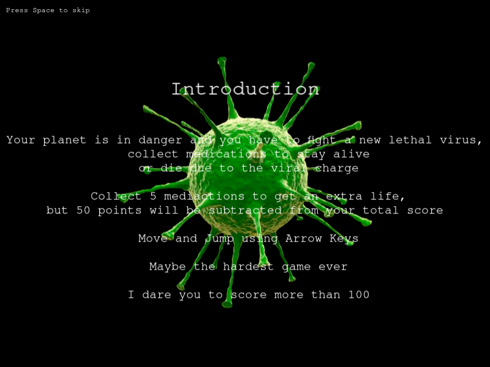
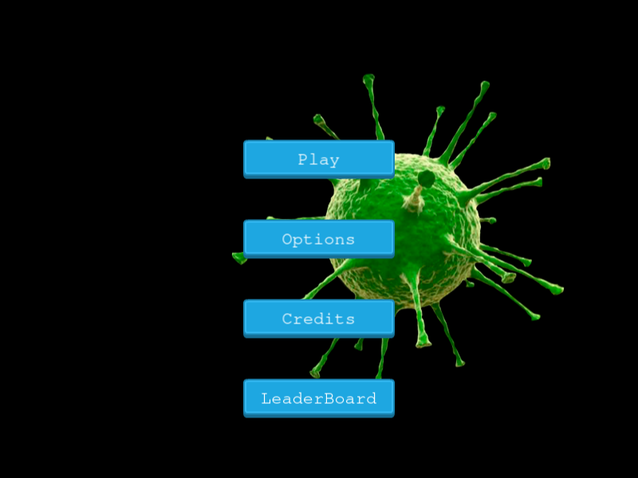
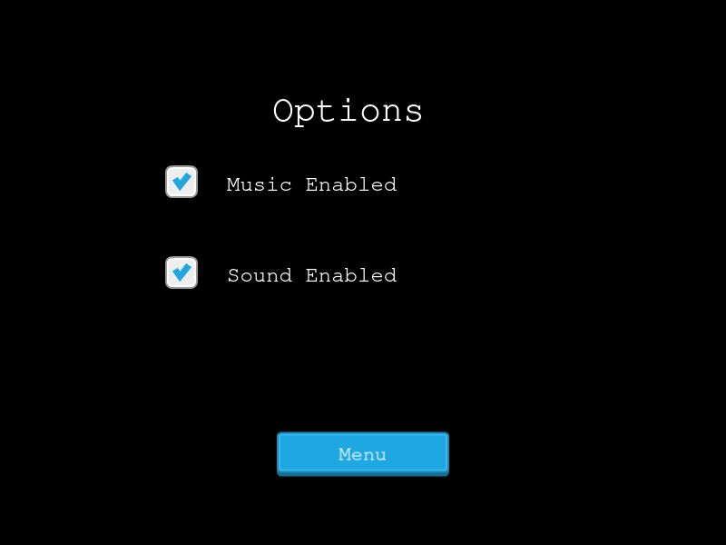
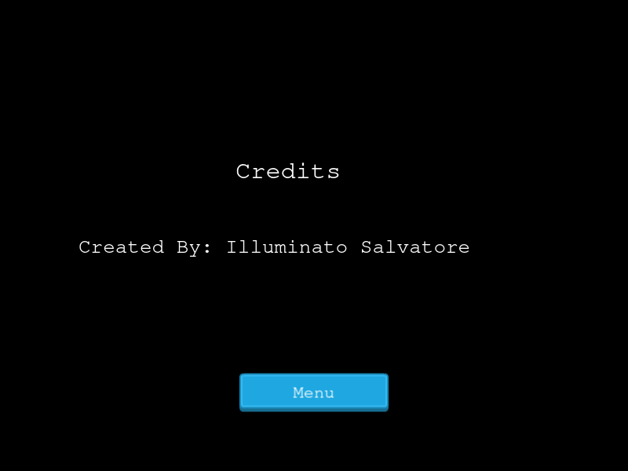
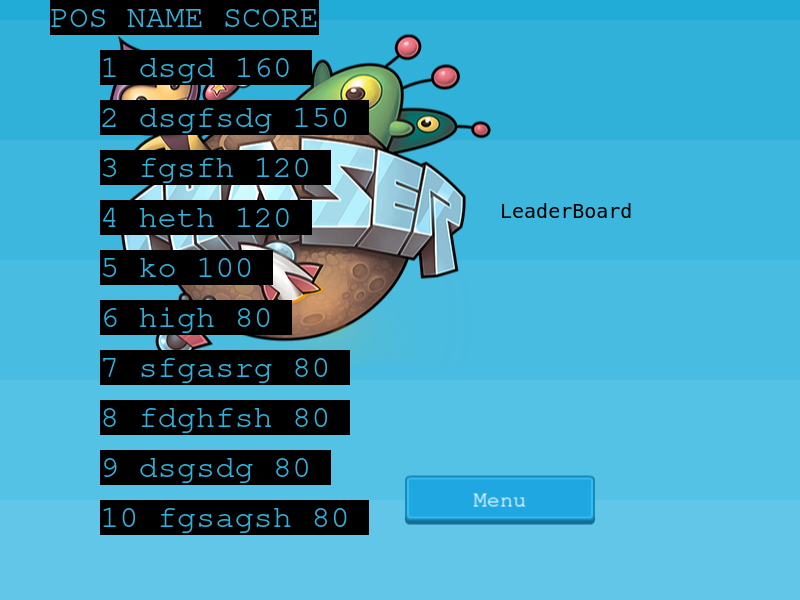
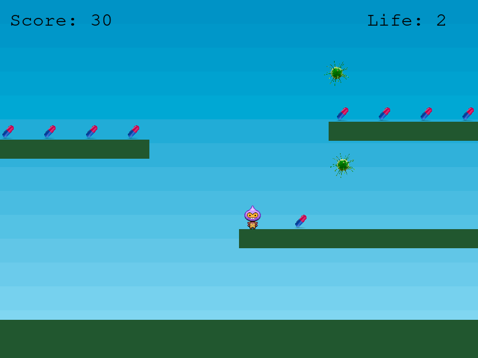
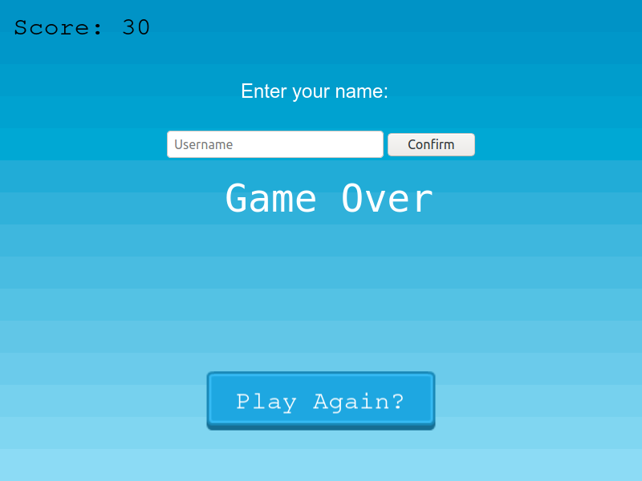

# Virus Run

## Is a game developed using Phaser3 framework, it uses HTML and Javascript to help us build game for mobile and any other environment that has a browser;

## The game consist of various scenes:

# Boot Scene
## Is the first scene loaded, usually show the logo and few other information

# Preloader 
## Is the scene used to load all the assets used in the game, this implement also a loading bar, where you can see the progress and the file name beiong loaded

# Intro
## An extra screen to give some context about the game, you can skip it using the spacebar

# Title
## The main screen, you can click on the buttons for options, credits, leaderboard or start playing

# Options
## Simple options screen, mute music or sound, but i hope you will like them

# Credits
## The author of the game 

# LeaderBoard
## This scene fetch data from an external api [here](https://us-central1-js-capstone-backend.cloudfunctions.net/api/), and place the score in descending order

# Play
## The game scene is where the action take place;
## Jump,dodge virus and move to get more pills as you can to make it to the top ten Leaderboard

# Game Over
## You loose?
## Sometimes can happen don't get discouraged, enter your name and start again, maybe you will be more lucky

# After the Boot, Preloader and Intro Scene you will brought to the title screen, here you can check out the leaderboard, or change sound and music options;
# To start the game press the play button;
# You use arrow keys to move and jump, avoid virus and collect pills to raise your score and gain extra lives;
# When your lives count is zero you will get to the Game over scene where you can enter your name, and your score will be publihed to the leaderboard;

# The game right now consist of just one playable scene, but adding new scenes from now on will be much easier;
# At the beginning the goal was to develop a game with more enemies and better graphics, but time don't let let me do better;